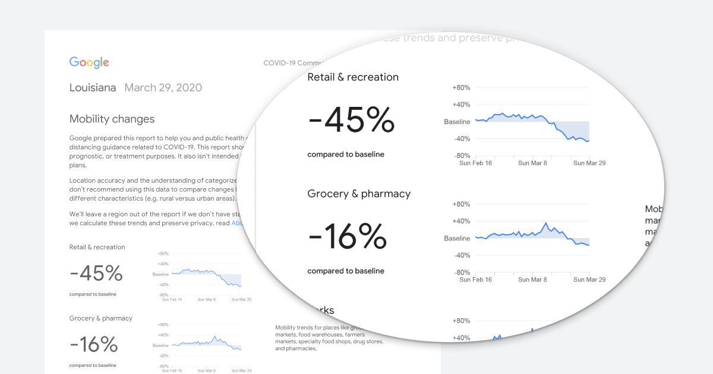

# Google COVID-19 Mobility Reports

Archive of the [Google COVID-19 Mobility Reports'][google-reports] PDFs and their data extracted
as a CSV.

## Motivation

Google launched [a series of reports][google-reports] on their user's mobility
during the Coronavirus pandemic. According to their website, the reports "chart
movement trends over time by geography, across different categories of places
such as retail and recreation, groceries and pharmacies, parks, transit
stations, workplaces, and residential."



This data is very interesting and important during these times. However, it's
only available as a PDF per country (or per State in the USA). This project has
two goals:

1. Provide an archive of the reports
2. Extract this data into a more convenient format (CSV or JSON)

## Where is the data?

* Raw PDF reports: [data/raw/reports](data/raw/reports)
* Reports converted to CSV: [data/processed/mobility_reports.csv](data/processed/mobility_reports.csv)

## How reliable is the CSV?

I've been very careful in checking that the data in the CSV corresponds to the
data in the PDF. There are tests to reduce the possibility of bugs being
introduced, and I manually checked a few of the results.

That being said, there are no guarantees that the data is error-free. I
recommend double checking the CSV with the raw PDFs if you want to be sure. If
you find any errors, please [create an issue][new-issue].

## Installing

To run it locally, you need [pdftotext][pdftotext] and a recent Python version
(tested on 3.8, but it should work on 3.6+). You can then download any new
reports and parse the files by running `make`.

This will download [the main Mobility Reports' HTML page][google-reports],
saving it into [data/raw/html](data/raw/html), then download any new PDF
reports into [data/raw/reports](data/raw/reports), and finally parse them,
saving the results to
[data/processed/mobility_reports.csv](data/processed/mobility_reports.csv).

If you want to convert a single report PDF to CSV, run:

```
PYTHONPATH=. python mobility_reports/cli.py <PATH_TO_THE_PDF>
```

This command accepts multiple paths, and outputs the CSV to stdout.

## License

The data is copyrighted by Google. Everything else is licensed under the [MIT
License](LICENSE.txt).

[google-reports]: https://www.google.com/covid19/mobility/
[new-issue]: https://github.com/vitorbaptista/google-covid19-mobility-reports/issues
[pdftotext]: http://poppler.freedesktop.org
